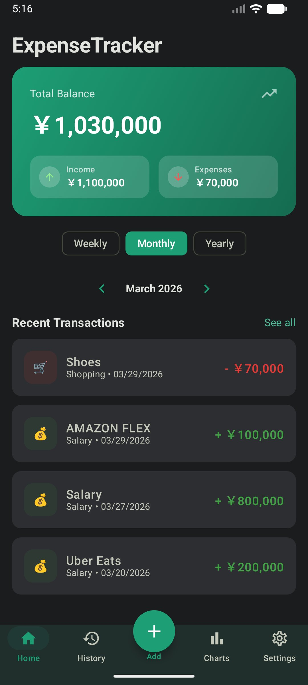
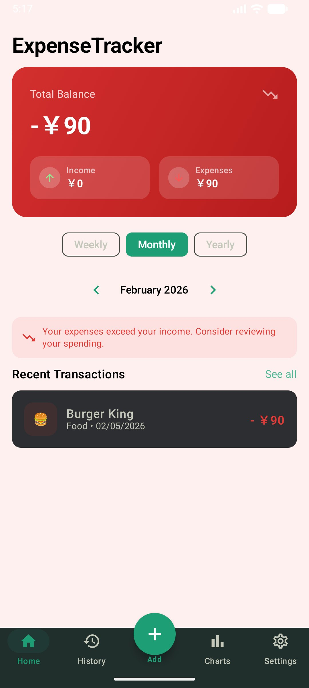
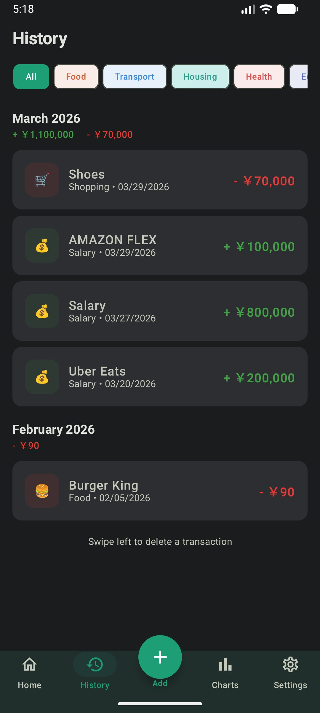
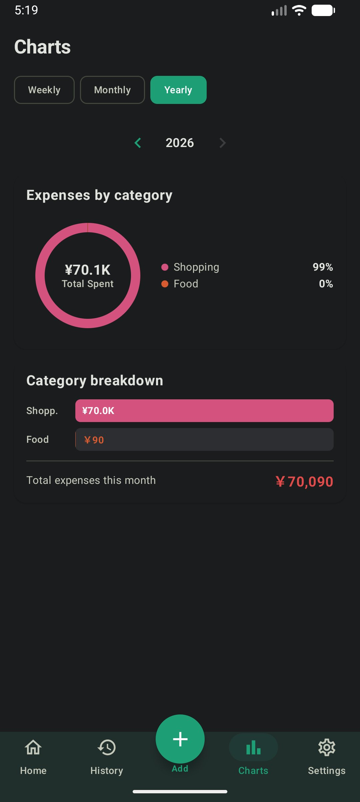
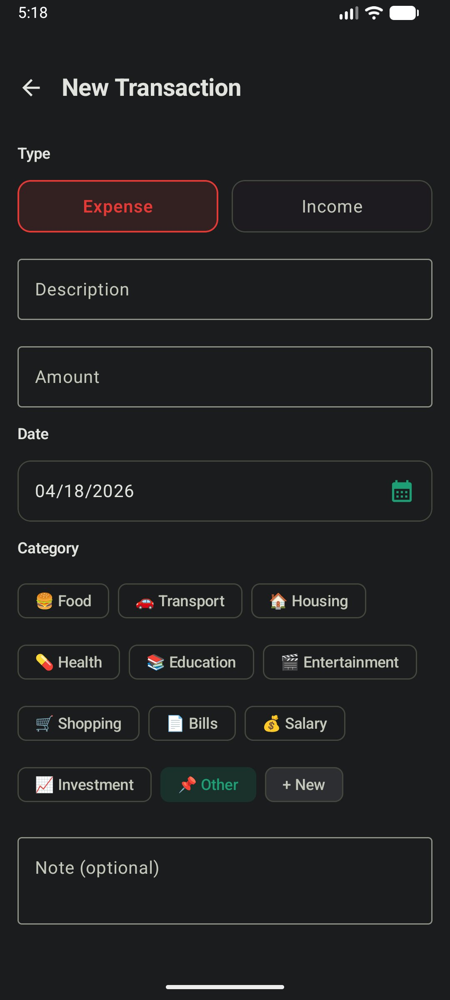
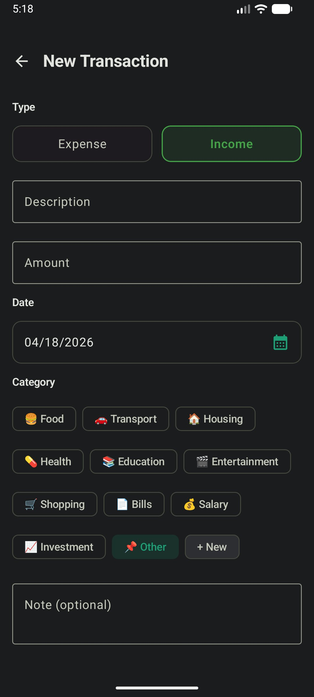
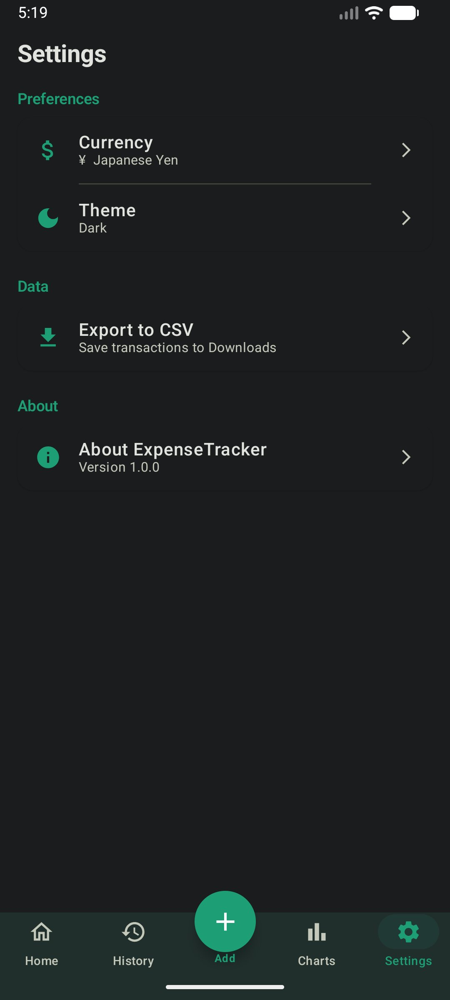

# 💰 ExpenseTracker

A modern Android expense tracking app built with **Kotlin**, **Jetpack Compose**, and **Clean Architecture**. Designed to help users manage their finances with an intuitive UI, detailed analytics, and multi-currency support.

[](https://github.com/bbruno10/expense-tracker/actions/workflows/android-ci.yml)

---

## 📱 Screenshots

<p align="center">
  
  
  
  
</p>

<p align="center">
  
  
  
</p>

---

## ✨ Features

- **Dashboard** — Overview of balance, income, and expenses with animated gradient cards that change color when balance is negative
- **Add/Edit Transactions** — Categorize with emoji icons, set dates with Material3 DatePicker, and add optional notes
- **History** — View all transactions grouped by month with category filters and swipe-to-delete
- **Charts** — Donut chart for expense distribution and bar chart breakdown by category
- **Period Navigation** — Filter data by week, month, or year with intuitive navigation arrows
- **Multi-Currency** — Support for USD, BRL, AUD, EUR, GBP, and JPY with persistent preferences
- **Theme Selection** — Light, Dark, and System default modes
- **CSV Export** — Export all transactions to a CSV file in the Downloads folder
- **Negative Balance Alert** — Visual warning when expenses exceed income

---

## 🏗️ Architecture

The project follows **Clean Architecture** with **MVVM** pattern, ensuring separation of concerns and testability.

```
app/src/main/java/com/example/expensetracker/
├── data/
│   ├── local/          # Room Database, DAO, Entity, Converters
│   ├── preferences/    # DataStore for user settings
│   └── repository/     # Repository implementations
├── di/                 # Hilt dependency injection modules
├── domain/
│   ├── model/          # Business models (Transaction, Category, TransactionType)
│   ├── repository/     # Repository interfaces
│   └── usecase/        # Use cases (Add, Delete, GetBalance, etc.)
├── presentation/
│   ├── add/            # Add/Edit transaction screen
│   ├── chart/          # Charts screen with donut & bar charts
│   ├── history/        # Transaction history with filters
│   ├── home/           # Home dashboard
│   ├── navigation/     # Navigation graph & bottom nav
│   ├── settings/       # Settings screen
│   └── util/           # Currency formatter utility
└── ui/theme/           # Material3 theme, colors, typography
```

---

## 🛠️ Tech Stack

| Category | Technology |
|---|---|
| **Language** | Kotlin |
| **UI** | Jetpack Compose + Material3 |
| **Architecture** | Clean Architecture + MVVM |
| **DI** | Hilt (Dagger) |
| **Database** | Room |
| **Preferences** | DataStore |
| **Async** | Coroutines + Flow |
| **Navigation** | Jetpack Navigation Compose |
| **Annotation Processing** | KSP |
| **CI/CD** | GitHub Actions |
| **Testing** | JUnit4, MockK, Turbine, Coroutines Test |

---

## 🧪 Testing

The project includes **79 unit tests** covering the core business logic:

| Test Class | Tests | Coverage Area |
|---|---|---|
| `ConvertersTest` | 8 | Room type converters |
| `TransactionMapperTest` | 7 | Entity ↔ Domain mapping |
| `TransactionRepositoryImplTest` | 10 | Repository with mocked DAO |
| `CategoryTest` | 7 | Category enum integrity |
| `AddTransactionUiStateTest` | 3 | UI state defaults |
| `AddTransactionViewModelTest` | 22 | Validation, events, save/edit flow |
| `HomeViewModelDateRangeTest` | 12 | Date range calculations & labels |
| `ScreenTest` | 9 | Navigation routes |

Run tests locally:

```bash
./gradlew testDebugUnitTest
```

Tests also run automatically on every push via GitHub Actions.

---

## 🚀 Getting Started

### Prerequisites

- Android Studio Ladybug or later
- JDK 17
- Android SDK 26+

### Setup

1. Clone the repository:
```bash
git clone https://github.com/bbruno10/expense-tracker.git
```

2. Open the project in Android Studio

3. Sync Gradle and run the app on an emulator or device (API 26+)

---

## 📋 Roadmap

- [x] Home dashboard with balance cards
- [x] Add/Edit/Delete transactions
- [x] Category-based organization with emoji icons
- [x] Period filtering (Weekly/Monthly/Yearly)
- [x] Donut & bar chart analytics
- [x] Transaction history with swipe-to-delete
- [x] Multi-currency support (6 currencies)
- [x] Light/Dark/System theme
- [x] CSV data export
- [x] Unit tests (79 tests)
- [x] CI/CD with GitHub Actions
- [ ] Custom categories
- [ ] Recurring transactions
- [ ] Budget goals per category
- [ ] Biometric lock

---

## 👤 Author

**Bruno Brandão**

- GitHub: [@bbruno10](https://github.com/bbruno10)

---

## 📄 License

This project is for portfolio and educational purposes.
